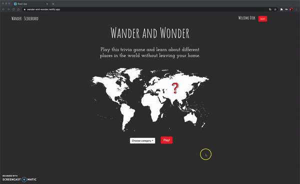

# Wander and Wonder

[Live version of the Wander and Wonder game!](wander-and-wonder.netlify.app)

### Table of contents

- [ABOUT](#about)
- [THE APP](#about-the-app)
- [GOALS](#goals)
- [USER STORIES](#user-stories)
- [TECHNOLOGIES](#technologies)
- [DEMO](#demo)
- [SETUP](#setup)

## ABOUT THE APP :world_map:

Wander and Wonder is a group project made during the [Codaisseur Academy](https://github.com/Codaisseur). It’s a game developed to learn more about the location of all countries in the world, and to peak someone’s interest in geography in a fun way.

As a player of Wonder and Wander you can start three different kinds of games (this will be extended in the future). In the game a country name or flag will be given and the player has to click on the corresponding country on the map.

- [Projectboard](https://github.com/users/mipes4/projects/2)
- [Wireframe](https://wireframepro.mockflow.com/view/travel-game#/page/0d6617e728a245cb9ad1d6525e129c9d)
- [Backend Repo](https://github.com/mipes4/wander-and-wonder-server)

Development team:

- [Dirk Scholten](https://github.com/SrSombre)
- [Jenna Leysens](https://github.com/JennaLeysens)
- [Sowjanya Mekala](https://github.com/sowjanyam27)
- [Michelle Pesch](https://github.com/mipes4)

## GOALS :dart:

- Work with version control as a team
- Practice full stack development
- Practice process management with Agile
- Theme in mind for designing this app: travelling
- Explore new territory in using libraries
- Implementation of charts in React
- Implementation of animations

## USER STORIES :bookmark_tabs:

- As a player I would like to learn where countries are in the world
- As a player I would like to play a game that allows me to learn something about geography
- As a player I would like to earn points that turns into a score I can try to beat
- As a player I would like to be able to compare my score with other players

## TECHNOLOGIES :hammer_and_wrench:

**Frontend**

- Node.js
- React
- Redux
- Axios
- React-Bootstrap
- Anime-React
- Highcharts-React
- SCSS

**Backend**

- Express
- REST API
- Sequelize
- PostgreSQL
- Middleware

## DEMO :popcorn:

